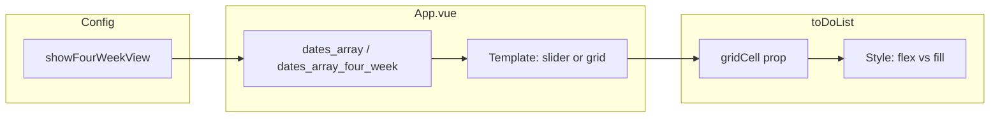

# 4-Week View Plan

## Name and scope

- **View name:** "4-Week View" (i18n: `settings.fourWeekView`)
- **Logic:** 4 rows = 4 weeks (top row is the current week), 7 columns = Monday–Sunday. The `weekStartOnMonday` setting will be used (Monday on the left, Sunday on the right).

## 1. Config and migration

- **[configRepository.js](src/repositories/configRepository.js):** Add `showFourWeekView: false` to the default config.
- **[migrations.js](src/migrations/migrations.js):** Add a migration that sets `showFourWeekView` to `false` when missing in existing configs (with version check).

## 2. Settings (Display) switch

- **[configModal.vue](src/views/configModal.vue):** In the Display tab (`#config-display`), add a new `form-check form-switch` after the existing "Compact View" switch (or in a suitable place):
  - Label: `$t('settings.fourWeekView')`
  - `v-model="configData.showFourWeekView"`
  - `@change="changeConfig('showFourWeekView', configData.showFourWeekView)"`
- Ensure `configData` in configModal is populated from `configProp`; the new field will be included (via configRepository and migration).

## 3. i18n

- **[en.json](src/assets/languages/en.json):** `settings.fourWeekView`: `"4-Week View"`.
- Other language files (tr, de, fr, etc.): Add the same key with the appropriate translation (at least tr: "4 Haftalık Görünüm").

## 4. App.vue: Date list and layout

- **Computed – 4-week date list:**  
A list used when `showFourWeekView === true`:
  - Start of the week containing `selected_date`: if `weekStartOnMonday` then `moment(selected_date).startOf('isoWeek')`, else `moment(selected_date).startOf('week')`.
  - From that date, 28 days (4 weeks x 7 days) in order: week 1 Mon–Sun, week 2 Mon–Sun, week 3, week 4. Each day as id in `YYYYMMDD` format (aligned with list id).
  - Result: an array of 28 elements; order matches the grid (row 0: days 0–6, row 1: days 7–13, …).
- **Existing `dates_array`:**  
Only computed when `showFourWeekView === false`; when `true`, either a separate computed can return the 4-week list or `dates_array` can have two branches in one computed. Important: the list ids shown in the calendar area must come from this computed.
- **Template:**  
  - Conditional render inside the calendar container (the block with `v-show="showCalendar"`):
    - `showFourWeekView === false`: Keep the current structure (left/right arrows + `todo-slider weekdays` + `to-do-list` with `v-for="date in dates_array"`).
    - `showFourWeekView === true`: A new wrapper (e.g. `div.four-week-grid`) with a 7-column grid:
      - CSS: `display: grid; grid-template-columns: repeat(7, 1fr); grid-template-rows: repeat(4, 1fr);` (and suitable min-height / height).
      - One `to-do-list` per cell with `v-for="date in dates_array_four_week"` (or a single `dates_array` that returns 28 elements in 4-week mode); `:id="date"` stays the same.
  - In 4-week mode the left/right arrows can be hidden or behave differently (e.g. week navigation); for the first version, just changing the view and hiding the arrows is enough.
- **initialListToLoad:**  
In `beforeCreate` (or wherever initial load is done), use 28 as the day count when `showFourWeekView === true` (otherwise keep the current `columns + 2` logic). So when 4-week view is enabled, load is triggered for 28 lists.

## 5. toDoList.vue: Use in grid cell

- **Prop:** e.g. `gridCell: { type: Boolean, default: false }`.
- **Root div style:**  
Currently: `:style="\`flex: 0 0 ${100 / columns}%;"`. When` gridCell === true`do not apply this flex rule (e.g. use`width: 100%; height: 100%; min-height: 0` or empty style) so the grid cell fills correctly.
- **Behaviour:** List content and `list-header` stay the same; only the outer container adapts to the grid. Each cell already has `fake-lines` (same row look).

## 6. Styles (4-week grid)

- **App.vue (or relevant SCSS):**  
For `.four-week-grid`:
  - Grid layout, optional gap, aligned with the container’s `resizableStyle` height (4 rows with equal share).
  - Per-cell inner scrolling with `min-height: 0` and `overflow: auto` so each day box scrolls inside itself and the fake-lines look is preserved.

## 7. Flow summary

- User turns on the "4-Week View" switch under Settings > Display → `showFourWeekView = true` → config is updated.
- App.vue computes the 4-week date list and renders the grid with 28 ids.
- Each cell uses the existing `toDoList`; with `gridCell=true` the style fits the grid; the row look (fake-lines) stays the same.

## File list (to change / add)

| File                                                                         | Change                                                                                 |
| ---------------------------------------------------------------------------- | -------------------------------------------------------------------------------------- |
| [src/repositories/configRepository.js](src/repositories/configRepository.js) | Default `showFourWeekView: false`                                                      |
| [src/migrations/migrations.js](src/migrations/migrations.js)                 | `showFourWeekView` migration                                                           |
| [src/views/configModal.vue](src/views/configModal.vue)                       | 4-Week View switch in Display                                                          |
| [src/assets/languages/en.json](src/assets/languages/en.json)                 | `settings.fourWeekView`                                                                |
| [src/assets/languages/tr.json](src/assets/languages/tr.json)                 | Same key (and other languages)                                                         |
| [src/App.vue](src/App.vue)                                                   | 4-week computed, conditional template (slider vs grid), initialListToLoad, grid styles |
| [src/components/toDoList.vue](src/components/toDoList.vue)                   | `gridCell` prop and root style condition                                               |

## Notes

- Date selection in the sidebar updates `selected_date`; in 4-week view the 4 weeks are computed so the week containing that date is the top row.
- Repeating events and loadTodoLists work with existing list ids (YYYYMMDD), so no extra change is needed; only 28 ids are used.
- In the first release the left/right arrows can be hidden in 4-week mode; "next 4 weeks" navigation can be added later.

