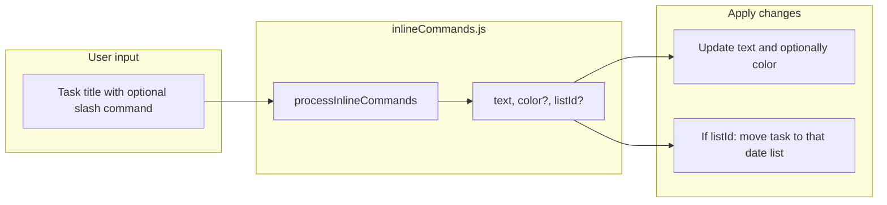

# Inline Commands (Task Title Commands) Plan

## Current structure summary

- **Task title editing** happens in two places:
  1. **List view**: [toDoItem.vue](c:\Users\yasin\Desktop\basi-tay\src\components\toDoItem.vue) – `v-model="text"`, on Enter/blur `doneEdit()` → `updateTodo({ text })` + `toDoListRepository.update`.
  2. **Modal**: [toDoModal.vue](c:\Users\yasin\Desktop\basi-tay\src\views\toDoModal\toDoModal.vue) – title `v-model="todo.text"`, `doneEditTitle()` → `updateTodo()` (todo object is already a store reference).
- **Date**: A task’s “date” is effectively which list it belongs to: `toDo.listId`. For calendar lists `listId` = `YYYYMMDD`. Changing date = moving the task to another list id (remove + insert + save both lists).
- **Color**: `toDo.color`. [colorPicker.vue](c:\Users\yasin\Desktop\basi-tay\src\views\toDoModal\colorPicker.vue) values: `none`, `#77e785` (green), `#6b7280` (gray), `#ed544b` (red), `#06b6d4` (blue), etc.
- **Store**: In [todolist.store.js](c:\Users\yasin\Desktop\basi-tay\src\store\modules\todolist.store.js), `updateTodo` currently only updates `text` (and repeatingEvent null); no color or move support.

## Implementation steps

### 1. Inline command helper

**New file**: `src/helpers/inlineCommands.js`

- **Function**: `processInlineCommands(inputText)`
  - Input: task title string.
  - Output: `{ text, color?, listId? }`
    - `text`: title with command(s) stripped and trimmed (e.g. "dokumanlar gozden gecirilecek /tod" → "dokumanlar gozden gecirilecek").
    - `color`: set only when a command requires a color or /tod (default green).
    - `listId`: only for date commands, the target day’s `YYYYMMDD` value (computed with moment).
- **Command mapping** (regex: `/\/ (tod|yes|tom|tom\+1|yes-1|green|gray|red|blue)\b/gi` or similar; word boundary):
  - **Date**: `/tod` → today, set color to green (`#77e785`).
  - `/yes` → yesterday.
  - `/tom` → tomorrow.
  - `/tom+1` → day after tomorrow (2 days from now).
  - `/yes-1` → day before yesterday (2 days ago).
  - For date commands the command text is removed from the title; color is unchanged except for `/tod`.
  - **Color only**: `/green` → `#77e785`, `/gray` → `#6b7280`, `/red` → `#ed544b`, `/blue` → `#06b6d4`.
  - If multiple commands exist, all are applied (e.g. date then color); only the command parts are removed from the text.
- If no command in title, return `{ text: inputText.trim() }`; caller keeps existing `color`/`listId` when not present.

### 2. Store update

**File**: [todolist.store.js](c:\Users\yasin\Desktop\basi-tay\src\store\modules\todolist.store.js)

- In `updateTodo(state, obj)`:
  - If `obj.color` is present, set `state.todoLists[obj.toDoListId][obj.index].color = obj.color`.
  - This allows list view to update text + color in a single mutation.

### 3. List view – toDoItem.vue

**File**: [toDoItem.vue](c:\Users\yasin\Desktop\basi-tay\src\components\toDoItem.vue)

- In `doneEdit()`:
  1. Call `inlineCommands.processInlineCommands(this.text)`.
  2. **If only text (and optionally color) changed**:
    - `updateTodo({ toDoListId, index, text: result.text, color: result.color })` (if no color, keep current).
    - `toDoListRepository.update(toDoListId, ...)`.
  3. **If listId changed** (date command):
    - If target `listId` is a valid date (YYYYMMDD):
      - First `this.$store.dispatch('loadTodoLists', result.listId)` to load target list.
      - In `then`: `removeTodo` (from current list), update task object `listId`, `text`, `color`, `insertTodo` (into target list), or follow existing “move” logic (e.g. drag-drop in toDoList.vue) remove + add + `toDo.listId = result.listId` etc.
      - Call `toDoListRepository.update` for both lists.
    - If target list is not in store, `loadTodoLists` will load or create empty list; use same remove/insert/update flow.

### 4. Modal – toDoModal.vue

**File**: [toDoModal.vue](c:\Users\yasin\Desktop\basi-tay\src\views\toDoModal\toDoModal.vue)

- In `doneEditTitle()`, before calling `updateTodo()`:
  1. Call `inlineCommands.processInlineCommands(this.todo.text)`.
  2. Set `this.todo.text = result.text`.
  3. If `result.color`, set `this.todo.color = result.color`.
  4. If `result.listId` (and different from current `this.todo.listId`):
    - Call `this.moveToTodoList(result.listId)` (already handles date/list change and `updateTodoList`).
  5. Then call existing `updateTodo()` (if list was moved, modal’s `todo` reference will already be up to date).
- Note: `moveToTodoList` uses `loadToDoFormDB` when target list is not in store; for date commands target is always YYYYMMDD, so it should align with current calendar/list loading logic.

### 5. README documentation

**File**: [README.md](c:\Users\yasin\Desktop\basi-tay\README.md)

- Add a “Features” or new “Inline commands” section (in English):
  - Explain that when short commands starting with `/` are typed in the task title, date and color are updated automatically.
  - Command list:
    - **Date**: `/tod` (today, set date to today, remove command from title, set color to green), `/yes` (yesterday), `/tom` (tomorrow), `/tom+1` (day after tomorrow), `/yes-1` (two days ago).
    - **Color**: `/green` (default), `/gray` (done), `/red` (needs to be done that day), `/blue` (cancelled).
  - Example: adding “ /tod” to title “dokumanlar gozden gecirilecek” moves the task to that day and removes the command from the title.

## Flow summary

## Things to watch

- Commands may be case-insensitive (`/TOD`, `/tod` same).
- Multiple commands in title (e.g. “/tod /red”) should be parsed in one pass and all applied; only the command tokens are removed from the text.
- Date commands only make sense for calendar lists (listId = YYYYMMDD); using `/tod` on a task in a custom list moves the task to that day’s list (loading target list is handled by existing `loadTodoLists` / `loadToDoFormDB` logic).
- i18n: Commands stay as English shortcuts; README and optionally UI can use “Inline commands” description; keys in `en.json` etc. can be added later if needed (README alone is enough for now).
